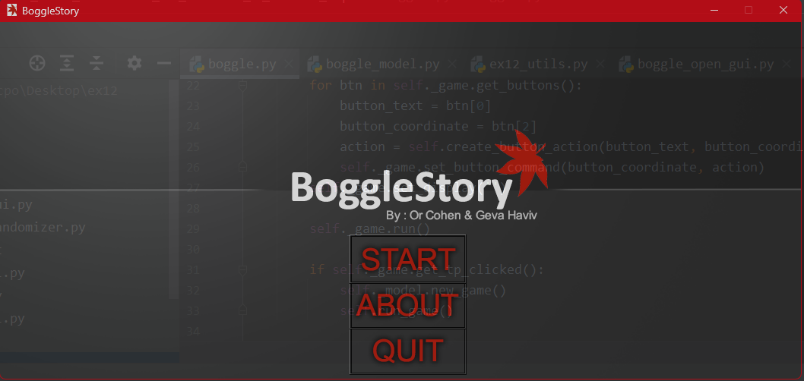
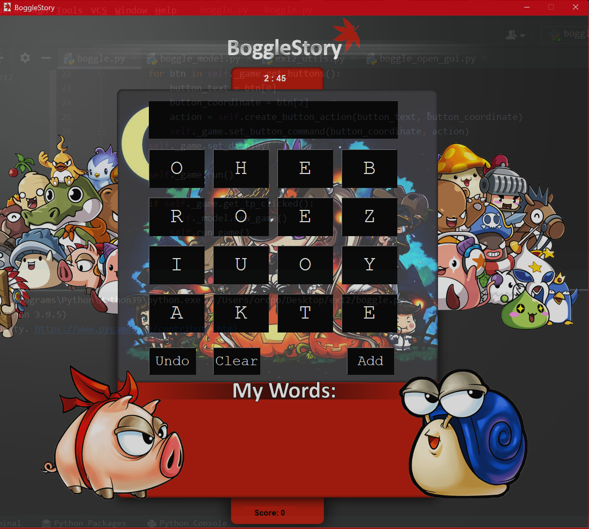

# Boogle Story
Boogle Story is a word game inspired by Maple Story, designed in Python using various libraries. In this game, players have to find as many words as they can by connecting adjacent letters on a 5x5 grid of randomly generated letters.

# Boogle Story Gameplay

# Installation
Clone this repository: git clone https://github.com/your-username/boogle-story.git
Install the required libraries: pip install -r requirements.txt
Usage
To start playing Boogle Story, run the following command in your terminal:

css
Copy code
python main.py
Rules
The game is played on a 5x5 grid of randomly generated letters. Players have to form words by connecting adjacent letters horizontally, vertically, or diagonally. The game ends after a fixed amount of time, and players earn points for each valid word they find. The longer the word, the more points they earn.

# Libraries Used
Pygame: for game development and user interface
PyDictionary: for checking word validity
Time: for timing the game
Credits
This project was developed by Your Name as a personal project.

# License
This project is licensed under the MIT License.

# Code Example
Here is a sample code snippet for generating the game grid:

python
Copy code
import random

# generate a 5x5 grid of letters
letters = ['A', 'B', 'C', 'D', 'E', 'F', 'G', 'H', 'I', 'J', 'K', 'L', 'M', 'N', 'O', 'P', 'Q', 'R', 'S', 'T', 'U', 'V', 'W', 'X', 'Y', 'Z']
grid_size = 5
grid = [[random.choice(letters) for j in range(grid_size)] for i in range(grid_size)]
print(grid)
Screenshots
Include screenshots of your game in action!
